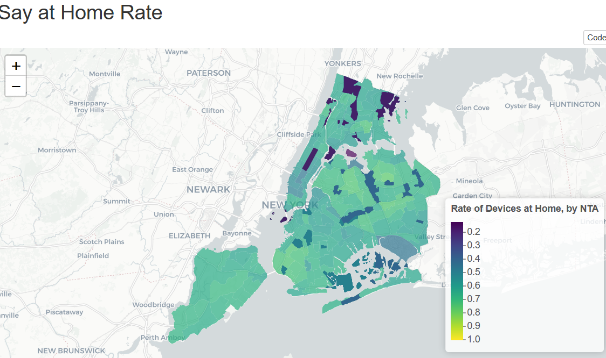
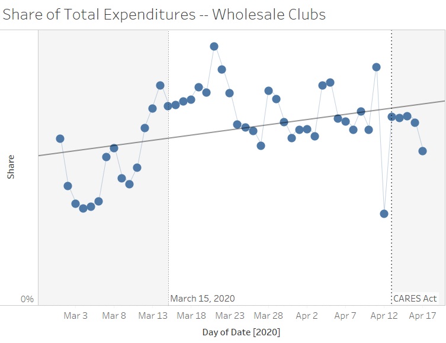

# COV19-SafeGraph-Data
 Rcode to read, create and analyze the Safegraph data for COV19. 

# Data Source
[Safegraph](https://docs.safegraph.com/docs )  provides amazing datasets related to COV19: 

- Social-Distancing data: on census tract level by date
- Weekly Visit pattern data: on POI level by week 
- Facteus spending data: on zipcode level, by brand and MCC, etc. 

# Analysis: 

## Example 1

Using the social distancing data, we plot on average the stay-at-home rate ( devices completely at home / total devicies ) for New York Neighbourhood. 

## Example 2

Using the Facteus data, we analyze what categories see the biggest decrease/increase in consumer expenditure since COV19. The plot below displays the share of expenditure on wholesale clubs on average across dates. 

